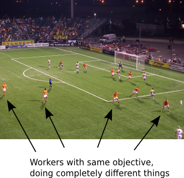
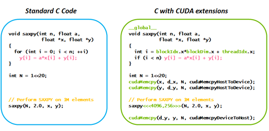
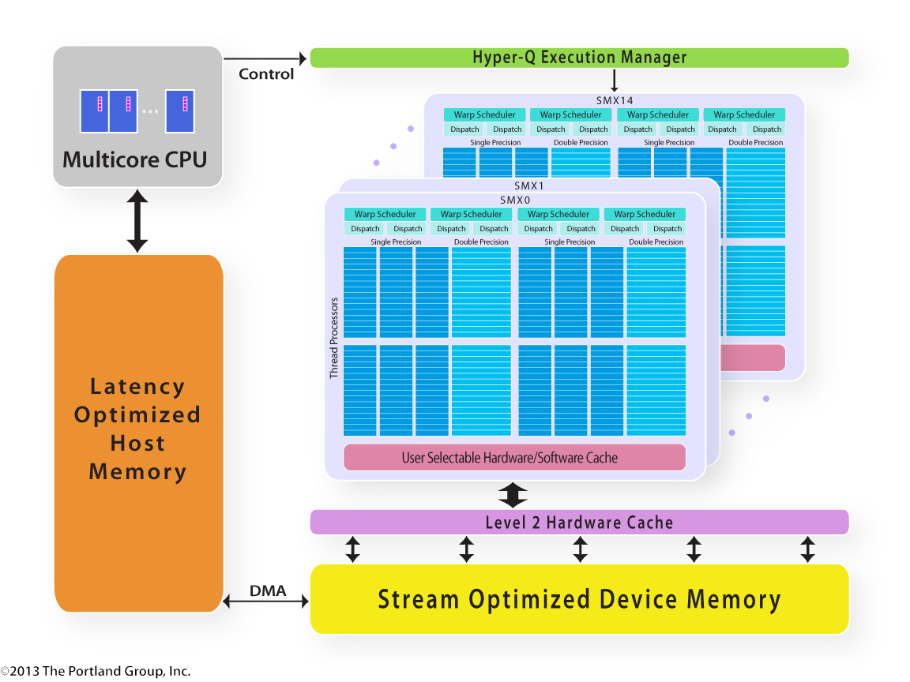
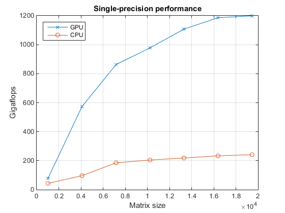
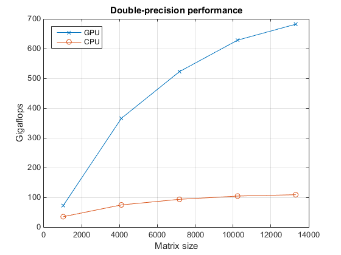
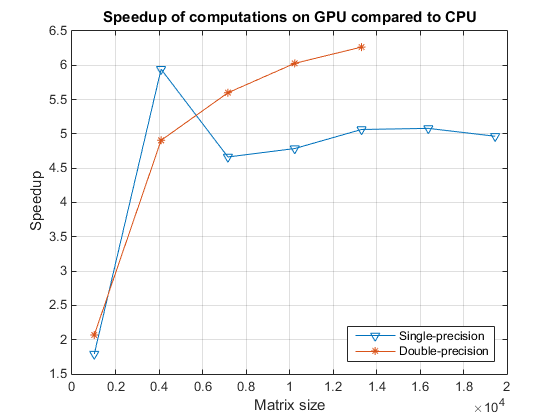

#NVIDIA docker

### Build and run docker containers leveraging NVIDIA GPUs


---

#New ?

* 0.0.0 POC - Jan 9, 2016
* 1.0.0 RC 3 - Jun 17, 2016
* POC was a shell script
* Now written in GO
* Supports the latest version of docker

---

#Benefits - NVIDIA

* Reproducable builds
* Ease of deployment
* Isolation of individual devices
* Run across heterogeneous driver/toolkit environments
* Require only the NVIDIA driver to be installed
* Enables "fire and forget" GPU applications
* Facilitate collaboration

---

#Benefits - PERSONAL (1)

* instead of using your desktop for playing games you can do HPC at home

* you could even do it on a decent notebook

* become a efficient data scientist and mine massive amounts of data

---

#Benefits - PERSONAL (2)

* open-source your work, share it, collaborate with and contribute to the open-source community

* commercialize your work, package, deploy, run and scale it on the cloud

* especially useful if you are a AI junkie who likes machine learning, deep learning and scientific computing

---

#Motiviation (1)

*  Docker containers are hardware and platform agnostic (Build, Ship, and Run Any App, Anywhere)

*  Docker containers are typically CPU-based applications

* NVIDIA GPUs are specialized hardware and require specialized drivers

* Docker containers does not natively support NVIDIA GPUs

---

#Motiviation (2)

* brittle workarounds that could work require the exact version of the host NVIDIA drivers to be installed inside the container as well as exposing the NVIDIA devices to the container (e.g. /dev/nvidia0)

* Docker images could not be easily shared and had to be built locally on each machine if driver versions did not match thus defeating one of the main advantages of Docker

---

#Before NVIDIA docker (1)

````sh
FROM ubuntu:14.04
MAINTAINER Traun Leyden <traun.leyden@gmail.com>

# A docker container with the Nvidia kernel module and CUDA drivers installed

ENV CUDA_RUN http://developer.download.nvidia.com/compute/cuda/6_5/rel/installers/cuda_6.5.14_linux_64.run

RUN apt-get update && apt-get install -q -y \
  wget \
  build-essential 

RUN cd /opt && \
  wget $CUDA_RUN && \
  chmod +x *.run && \
  mkdir nvidia_installers && \
  ./cuda_6.5.14_linux_64.run -extract=`pwd`/nvidia_installers && \
  cd nvidia_installers && \
  ./NVIDIA-Linux-x86_64-340.29.run -s -N --no-kernel-module

RUN cd /opt/nvidia_installers && \
  ./cuda-linux64-rel-6.5.14-18749181.run -noprompt

# Ensure the CUDA libs and binaries are in the correct environment variables
ENV LIBRARY_PATH=$LD_LIBRARY_PATH:/usr/local/cuda-6.5/lib64
ENV PATH=$PATH:/usr/local/cuda-6.5/bin
````

---

#Before NVIDIA docker (2)

````sh
$ docker run -ti \
--device /dev/nvidia0:/dev/nvidia0 \
--device /dev/nvidiactl:/dev/nvidiactl \
--device /dev/nvidia-uvm:/dev/nvidia-uvm \
tleyden5iwx /ubuntu-cuda /bin/bash
````

* [coreos-nvidia](https://github.com/Avalanche-io/coreos-nvidia)

* [debate against NVIDIA docker](https://news.ycombinator.com/item?id=11738072)

---

#After NVIDIA docker

````sh
# Install - Archlinux
$ sudo pacman -S nvidia docker nvidia-docker
````

````sh
# Test
$ nvidia-docker run --rm nvidia/cuda nvidia-smi
````

````sh
# Interactive
$ nvidia-docker run --rm -it nvidia/cuda
````

````sh
# Third-party images
# e.g. TensorFlow with all dependencies and support for Nvidia Cuda
$ nvidia-docker run -it -p 8888:8888 \
gcr.io/tensorflow/tensorflow:latest-gpu
````

---

#Internals

* NVIDIA driver
* Docker CLI wrapper
* Docker volume plugin / REST API
* GPU isolation
* Image inspection

---

#Internals NVIDIA driver (1)

* NVIDIA driver is composed of multiple kernel modules
````sh
$ lsmod | grep nvidia
````
* and also comes with user-level driver libraries to enable applications to communicate with the kernel modules and therefore the GPU devices
````sh
$ ldconfig -p | grep -E 'nvidia|cuda'
````
* these libraries are tied to the driver version

---

#Internals NVIDIA driver (2)

* the driver installer also comes with utility binaries

````sh
# System Management Interface
$ nvidia-smi

# load kernel module utility
$ nvidia-modprobe
````

---

#Internals NVIDIA driver (2)

* before NVIDIA docker containers had to install the user-level driver libraries (e.g. --no-kernel-module) from the driver installer
* The version of the kernel modules on the host had to match the exactly major and minor version of the user-level libraries
````sh
# running a container with a mismatched environment
# would immediately yield an error inside the container
$ nvidia-smi
Failed to initialize NVML: Driver/library version mismatch
````

---

#Internals NVIDIA driver (3)

* To solve the user-level driver library dependency NVIDIA provides Docker images on DockerHub that are generic
* but when creating a container the environment must be specialized for the host kernel module by mounting the user-level libraries from the host using the --volume argument of docker run
* This volume can be managed by using the nvidia-docker-plugin daemon which implements the Docker API for [volume plugins](https://docs.docker.com/engine/extend/plugins_volume/)

---

#Internals NVIDIA driver (4)

* NVIDIA docker parses /etc/ld.so.cache to find an and blacklists user-level NVIDIA driver libraries similar to running ldconfig -p to get all the shared libraries and their paths
* NVIDIA docker creates a named volume compose of hard links to the NVIDIA user-level driver [libraries](https://github.com/NVIDIA/nvidia-docker/blob/93bb65de7fc349e6de9f27abdaa75875f5572b17/tools/src/nvidia/volumes.go#L118-L168) 

````sh
# find NVIDIA docker volume
$ docker volume -f name=nvidia
# inspect it
$ docker volume inspect nvidia_driver_370.28
````

---

#Internals Docker CLI wrapper (1)

* The nvidia-docker Docker CLI wrapper automatically add the volume arguments to the command-line before passing control to docker, you only need to have the [nvidia-docker-plugin](https://github.com/NVIDIA/nvidia-docker/wiki/nvidia-docker-plugin)  nvidia-docker-plugin daemon running

````sh
# requires nvidia-docker-plugin to be running
# running without the Docker CLI wrapper
$ docker run --volume-driver=nvidia-docker \
--volume=nvidia_driver_370.28:/usr/local/nvidia:ro ...
# avoid using --volume-driver
docker volume create --name=nvidia_driver_361.48 -d nvidia-docker
````

---

#Internals Docker CLI wrapper (2)

* the docker

* alternatively you could do it manually using ldconfig -p but that would be error prone and you could be using an older driver install
* validation

````sh
$ ls -R $(docker volume inspect -f "{{ .Mountpoint }}" \
nvidia_driver_370.28)
````

---

#Internals Docker CLI wrapper (3)

* Internally, nvidia-docker calls docker and relies on the NVIDIA Docker plugin to discover driver files and GPU devices

````sh
# wrapper uses the plugin to do this
$ curl -s http://localhost:3476/v1.0/docker/cli?dev=0+1\&vol=nvidia_driver
# you can do without the wrapper
$ docker run -ti $(curl -s http://localhost:3476/v1.0/docker/cli?dev=0+1\&vol=nvidia_driver) cuda
````

---

#Internals Docker CLI wrapper (4)

* The command used by nvidia-docker can be [overridden](https://docs.docker.com/engine/reference/commandline/cli/)  using the environment variable NV_DOCKER

````sh
# Running nvidia-docker with a custom docker command e.g. Enable debug mode
$ NV_DOCKER='sudo docker -D' nvidia-docker \
 <docker-options> <docker-command> <docker-args>
````
* nvidia-docker only modifies the run and create Docker commands, other commands are just pass-through

* you can't execute GPU code when building a Docker image

---

#Internals GPU Isolation (1)

* GPUs are exported through a list of comma-separated IDs using the environment variable NV_GPU

* either the UUID or index can be used for the given device

````sh
# Running nvidia-docker isolating specific GPUs by index
$ NV_GPU='0,1' nvidia-docker \
<docker-options> <docker-command> \
<docker-args>
# Running nvidia-docker isolating specific GPUs by UUID
$ NV_GPU='GPU-836c0c09,GPU-b78a60a' nvidia-docker \
<docker-options> <docker-command> \
<docker-args>
````

---

#Internals GPU Isolation (2)

* by default, all GPUs are exported

````sh
# query GPU information
$ nvidia-smi -L
$ nvidia-smi --query-gpu=index,name,uuid --format=csv
````

* you can manually use docker instead of nvidia-docker to isolate the GPUs you want to allow access to the container

````sh
$ docker run --device=/dev/nvidiactl --device=/dev/nvidia-uvm --device=/dev/nvidia0
````

* this can be programmatically retreived using the CUDA API

---

#Internals Image Inspection (1)

* There is no generic solution for detecting if any image will be using GPU code

* nvidia-docker assumes that any image based on our nvidia/cuda images will use the require access to host GPU and require the driver volume and the device files

* nvidia-docker run inspects the image label with com.nvidia.volumes.needed

---

#Internals Image Inspection (2)

* all images FROM nvidia/cuda will automatically inherit this metadata and will automatically work with nvidia-docker

* nvidia-docker also checks if the image is compatible with the host driverby looking for the com.nvidia.cuda.version label

* The label is present in NVIDIA CUDA images with the corresponding CUDA API version number

* and is compared with the maximum CUDA version supported by the driver

---

#Internals Image Inspection (3)

* If the version is not supported, an error is raised before starting the container

````sh
$ nvidia-docker run --rm nvidia/cuda
nvidia-docker | 2016/04/21 21:41:35 Error: unsupported CUDA version: driver 7.0 < image 7.5
````

* validate images

````sh
$ docker inspect -f '{{index .Config.Labels "com.nvidia.volumes.needed"}}' nvidia/cuda
nvidia_driver
$ docker inspect -f '{{index .Config.Labels "com.nvidia.cuda.version"}}' nvidia/cuda
8.0
````

---

#CPU vs GPU Intro (1)

|             	| Haswell Xeon E7-8890 v4 	| Nvidia Telsa P100 	|
|-------------	|-------------------------	|-------------------	|
| TPD         	| 165 W                   	| 300 W             	|
| Transistors 	| 7.2 billion             	| 15.3 billion      	|
| Die Size    	| 456.12 mm²              	| 610 mm²           	|

---

#CPU vs GPU Intro (2)

|        	| Haswell Xeon E7-8890 v4 	| Nvidia Telsa P100      	|
|--------	|-------------------------	|------------------------	|
| Cores  	| 24                      	| 3840                   	|
| Clock  	| 3.40 Ghz                	| 1.480 Ghz              	|
| Memory 	| DDR4, 102 GB/s, 3 TB    	| GDDR5, 732 GB/s, 16 GB 	|
| Cost   	| ~$7K USD                	| ~$9K USD               	|

---

#CPU vs GPU Intro (3)

* are good at massive SIMD (Single Instruction Multiple Data)

* GPUs are composed of a many SMs stream processors (e.g. 56) which consists of a many cuda cores (e.g. 64)

* each SM can execute many warps

* each warp can execute 32 threads

---

#CPU vs GPU Intro (4)

* GPUs are good at doing simple things in parallel on massive amounts of data

 

---

#CPU vs GPU Intro (5)

* CPU are good at doing complex things and some can be done in parallel on a reasonable amount of data

 

---

#CPU vs GPU Intro (4)

* Hellow World program written in C with CUDA and  to run on the GPU

 

---

#CPU vs GPU Intro (4)

 

---

#CPU vs GPU Intro (5)

* CUDA[Cuda](https://blogs.nvidia.com/blog/2012/09/10/what-is-cuda-2/) is a parallel computing platform and programming model for GPGPU (General-purpose computing on graphics processing units) that is designed for Nvidia GPUs

* basically it's an API for C, C++ and Fortran, however now implemented in many modern languages (Python, C#, Java, Lua, and more)

* nvidia-docker facilitates this in docker

* [cuDNN](https://developer.nvidia.com/cudnn) cuDNN or NVIDIA CUDA Deep Neural Network library is a GPU-accelerated library of primitives for deep neural networks

* CUDA and cuDNN is used in many machine learning and deeep learning frameworks (Caffe, TensorFlow, Theano, Torch, CNTK, MXnet, Chainer, Keras and many more)

---

#CPU vs GPU Benchmarks (1)



---

#CPU vs GPU Benchmarks (2)



---

#CPU vs GPU Benchmarks (3)



---

#CPU vs GPU Bencharmks (4)

[https://github.com/jcjohnson/cnn-benchmarks](https://github.com/jcjohnson/cnn-benchmarks)

---

#Images

* [There are NVIDIA built images and Third-party images](https://github.com/NVIDIA/nvidia-docker/wiki/List-of-available-images) 

* [on docker hub](https://hub.docker.com/r/nvidia/)

---

#Build your own NVIDIA image

````sh
$ git clone https://github.com/NVIDIA/nvidia-docker.git
# Build all the CUDA images - would take a very long time
$ make cuda
# you can build a specific tag
# Build CUDA 7.0 runtime based on ubuntu 14.04
$ make -C ubuntu-14.04/cuda 7.0-runtime
# Build all the CUDA images for CentOS 6
$ make cuda OS=centos-6
````

---

#Uses
* Scientific Computing
* Machine Learning
* Deep Learning
* Cloud
* Embedded Systems - NVIDIA Jetson

---

#Demos

* using deep learning framework Torch and OpenCV

* forked and dockerized based on:  [szym/display](https://github.com/szym/display), [karpathy/neuraltalk2](https://github.com/karpathy/neuraltalk2), [jcjohnson/neural-style](https://github.com/jcjohnson/neural-style), [anibali/docker-torch](https://github.com/anibali/docker-torch), [Lua GPU/CPU Benchmark](https://gist.github.com/jaderberg/6436387)
  
*  [deep learning curated list](https://github.com/ChristosChristofidis/awesome-deep-learning) 

* [deep learning curated list for reinforcement learning](https://github.com/junhyukoh/deep-reinforcement-learning-papers) 

---

#What's next

* [Golearn](https://github.com/sjwhitworth/golearn) Golearn

* GPGPU on the cloud

* GPGPU scaling out

* distributed HPC - [twitter torch-distlearn](https://blog.twitter.com/2016/distributed-learning-in-torch) twitter torch-dislearn

* [OpenCL](https://www.khronos.org/opencl/) (Open Computing Language) which enables applications to run on heterogeneous platforms consisting of a multitude of computing devices such as CPUs, GPUs, DSPs, FPGAs to name some


