# Mesos / Marathon as a PaaS

<br/>
<br/>
<br/>

<br/>
<br/>
### Nicolas Bettenburg

#### Docker Meetup Ottawa - November 30th, 2016
<br/>
<br/>

---

# A Brief History of Dev and Ops

---

## In the Beginning there was the Monolith...

<br/>

<center>
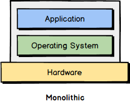
</center>

- Monolithic web application
- Running on a dedicated machine
- What a lot of application (still) look like today.
<br/>
<br/>

---

## High Availability and Scaling

<br/>

<center>
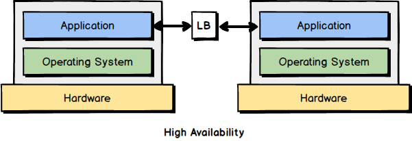
</center>

- Multiple duplicates of our monolithic web application
- Scalability, and high-availability
- Put a load-balancer in front
- Need to do extra legwork if application has to maintain state

---

## Hardware Virtualization
<center>
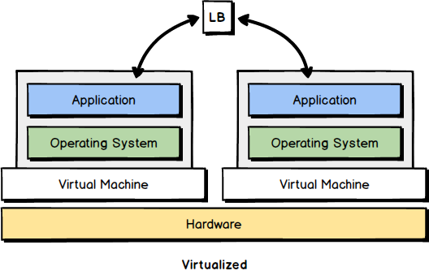
</center>

- Instead of dedicating bare-metal boxes, use Virtual Machines
- Make use of multi-core servers, better isolation
- VMs can move around, can be snapshotted, can be duplicated
- Inside VMs still monolithic applications

---

## Service-Oriented Architectures

<center>
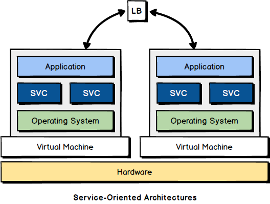
</center>

- Refactor monolith to create separation of concerns, API layers
- Better fault-tolerance, code re-use, maintainability.
- Developers think it's awesome, Ops start to moan a little ....

---

## Microservice Architectures

<center>
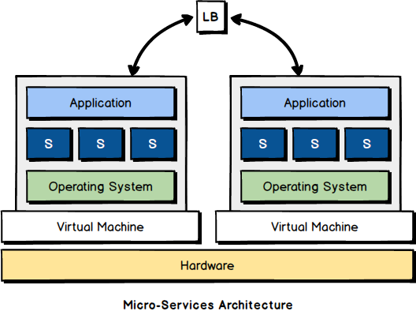
</center>

- N-Tier Microservices Application
- Single Purpose services, Isolation of concerns, Polyglot!
- Devs are happy, Ops are really starting to get upset

---

## Containers to the Rescue!

<center>
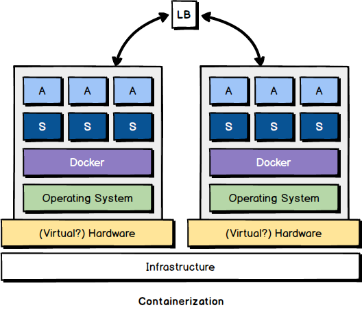
</center>

- Deployment becomes as breeze!
- Packaged Dependencies.
- Ops are now schedulers, too!

---

## DevOps now feels like this
<center>

</center>


---

# Container Orchestration
<br/>
<br/>
> "Continuous automated scheduling, coordination, and management of complex systems of containerized components and the resources they consume." -- Karl Isenberg

<br/>
<br/>

---

## Container Orchestration (1)

<br/>
<center>
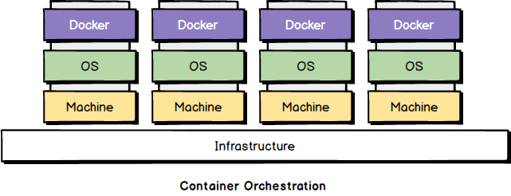
</center>

- Start with `n` machines
- Each provisioned with OS of choice
- Eachprovisioned with a Container runtime, such as `Docker`.
- On-Premise, Cloud, or maybe even in `Vagrant`.
- Goal: pool these resources to create a unified computing layer.


---

## Container Orchestration (2)

<br/>
<center>
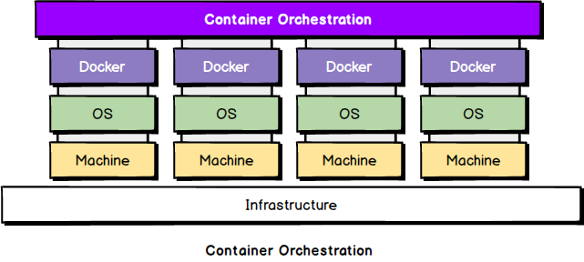
</center>

- Regular OS has a kernel and a scheduler.
- Need a distributed kernel, and a resource-aware scheduler.


---

## Let's Talk About Container Orchestration (3)

<br/>
<center>
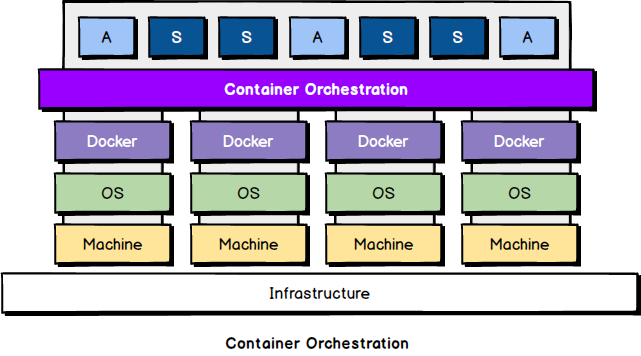
</center>

- Single 'layer' of resources to apps and services (Kernel)
- Executing containers and keeping them alive (Scheduler)


---

## Let's Talk About Container Orchestration (4)

<br/>
<center>
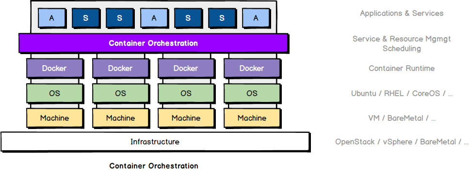
</center>

##### Plenty of choice across the entire stack!


---

## Container Orchestration Platforms

##### In this Talk:
- Kernel: `Apache Mesos` http://mesos.apache.org
- Scheduler: `Marathon` https://mesosphere.github.io/marathon/


<br/>

##### But Plenty Alternatives Exist:

- `Kubernetes` http://kubernetes.io
- `Rancher` http://rancher.com
- `Tectonic` http://tectonic.com
- `Openshift` http://openshift.com
- `DC/OS` http://mesosphere.com
- `Kontena` https://kontena.io/
- `Swarm` (`Docker` 1.12+)  https://docs.docker.com/swarm/

---

## Why did we pick Mesos?
<br/>
<br/>

- Battle-proven, general-purpose distributed systems kernel
- Scheduler "Frameworks" as plugins, e.g. `Chronos` for executing one-off recurring tasks (think cron).
- Dynamic and resource-aware partitioning of compute nodes
- Easy to scale loads elastically
- Easy to deal with failures
- Open-Source, production-grade
- Great success stories from major hitters (Twitter/Apple/...)
- Zero Downtime deployments / updates / rollbacks (blue-green, canary)
- Self-Healing infrastructure (let it crash!)

---

## Mesos/Marathon Architecture

<center>
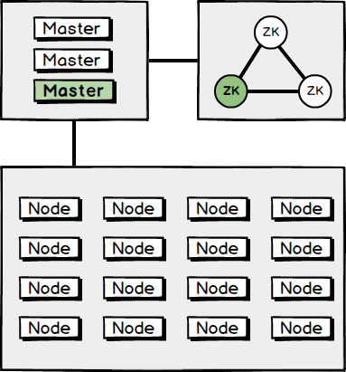
</center>

- `2*i-1` ZooKeeper Quorum as KV Store
- `2*k-1` Mesos Masters with scheduler plugins
- `j` Mesos Nodes with Docker as Container Runtime


---

## Imaginary Application Stack

<br/>
<br/>
<center>
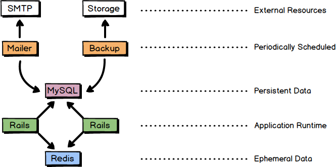
</center>
<br/>
<br/>

---

## Deployments described as Code

<br/>

```json
{
  "id": "hello-rails",
  "cmd": "cd hello && bundle install && bundle exec unicorn -p $PORT",
  "mem": 100,
  "cpus": 1.0,
  "instances": 1,
  "uris": [
    "http://downloads.mesosphere.com/tutorials/RailsHello.tgz"
  ],
  "env": {
    "RAILS_ENV": "production"
  }
}
```

`rails.json`


---

## Deployments with Marathon and Chronos (1)

<br/>
<center>
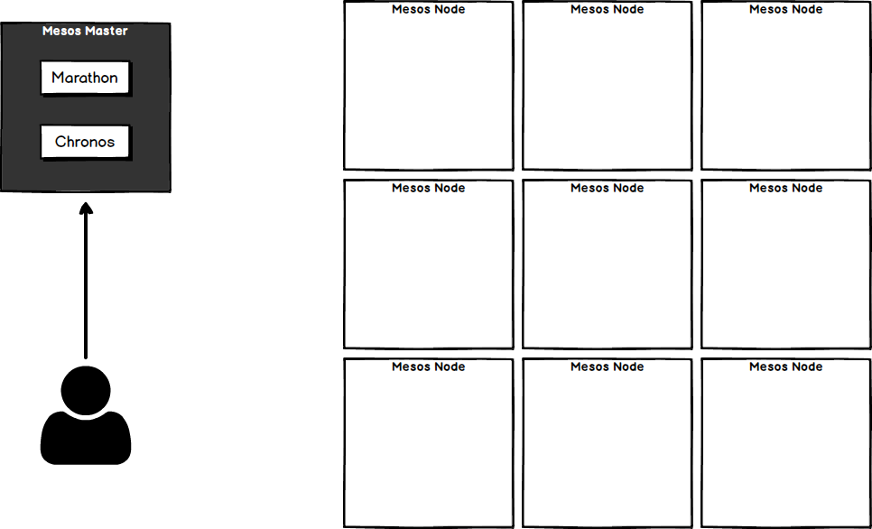
</center>

---

## Deployments with Marathon and Chronos (2)

<br/>
<center>
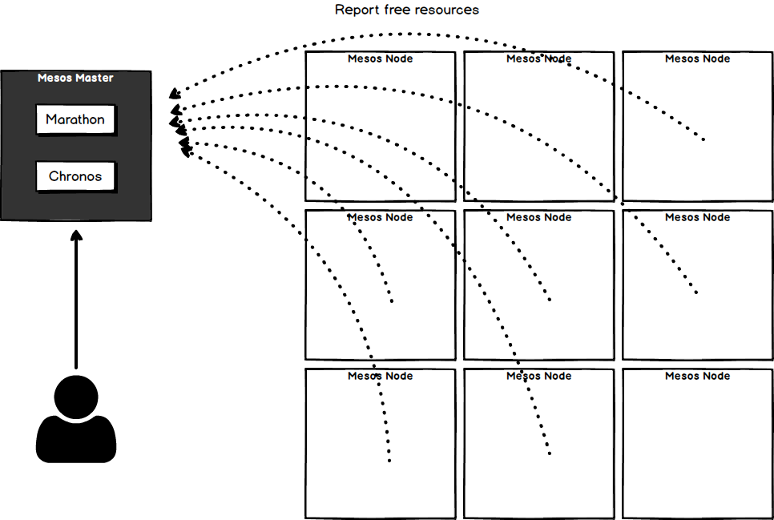
</center>


---

## Deployments with Marathon and Chronos (3)

<br/>
<center>
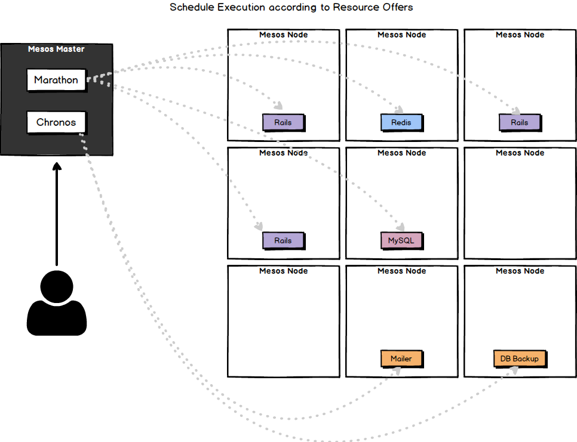
</center>


---

## Demo
<center>

</center>

---

## Day 2 Operations
To make this really useful we need a couple extra things:

- Service Discovery
- Network Segmentation
- Persistent Storage
- Dynamic North-South Routing
- Dynamic East-West Routing
- Monitoring
- Logging
- Blueprints describing complex applications


---

## Service Discovery

- DNS-based solutions:
    - SRV records
    - `SkyDNS` https://github.com/skynetservices/skydns
    - `MesosDNS` https://github.com/mesosphere/mesos-dns
    - `Consul` https://www.consul.io/

- Proxy-based solutions
    - `MarathonLB`    https://github.com/mesosphere/marathon-lb
    - `MinuteMan` https://github.com/dcos/minuteman
    - `Synapse` / `Nerve`   https://github.com/airbnb/synapse
    - `Bamboo` (Qubit)  https://github.com/QubitProducts/bamboo
    - `Traefik` https://traefik.io/

---

## Overlay Networks / Segmentation
- `Weave` https://www.weave.works/
- `Calico` https://www.projectcalico.org/

<center>
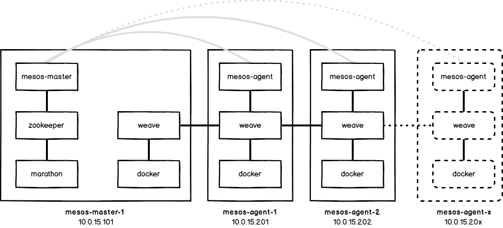
</center>

---

## Persistent Storage

- Host storage volumes (easy! but scheduling constraints)
- `Flocker` https://clusterhq.com/flocker/introduction/
- `Ceph`    http://ceph.com
- `Cinder`  https://wiki.openstack.org/wiki/Cinder
- `GlusterFS`   https://www.gluster.org
- `Rexray`  https://github.com/codedellemc/rexray
- `NFS` https://github.com/rancher/convoy
- `VFS` https://github.com/rancher/convoy
- `EBS` https://github.com/rancher/convoy
- `Azure FS`    https://github.com/Azure/azurefile-dockervolumedriver
- `GCE PD`  https://github.com/mcuadros/gce-docker
- And many more https://docs.docker.com/engine/extend/legacy_plugins/

---

## Monitoring

- `Heapster`    https://github.com/kubernetes/heapster
- `cAdvisor`    https://github.com/google/cadvisor
- `Prometheus`  https://prometheus.io
- `Datadog`     https://www.datadoghq.com
- `Docker` Stats API    https://docs.docker.com/engine/reference/commandline/stats/
- `Sysdig`  http://www.sysdig.org
- `Dynatrace`   https://www.dynatrace.com/solutions/application-monitoring/
- `SignalFX`    https://github.com/signalfx
- `NewRelic`    https://newrelic.com
- `Logz.io`     http://logz.io
- And many more

---

## Logging
- `Fluentd` Docker Driver
- `ELK` stack
- `Telegraph`
- `Docker` Logging Drivers

---

## Security

- Authentication
- ACLs
- Resource Quotas

### no real alternatives available :-/

#### (Really nobody has this figure out, yet!)

---

## What we've build so far

<center>
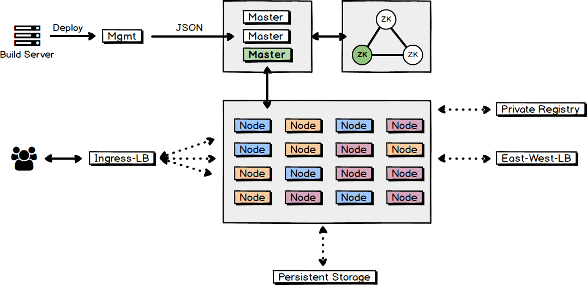
</center>

<br/>
### Run you own! https://github.com/nicbet/mesos-playground


---

## Experience so far / Take-Aways

- Starting point: self-healing, elastic
- Infrastructure as Code
    - Repeatable
    - Predictable
    - Self-documenting
- Application stack blueprints
    - Document system architecture
    - Document dependencies
- (Almost) full congruence between environments
    - Dev/CI
    - Staging
    - Production environments
- Service Discovery was really hard until Weave
- Taking predictability and repeatability to new level
- Finding fast adoption in DevOps beyond product fabric
