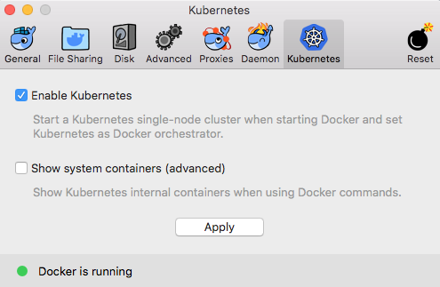

class: center, middle

# What's New in Docker CE: January 2018

---
# Docker CE Releases

## Stable Channel

* 17.12.0-ce (2017-12-27)
* 17.09.1-ce (2017-12-07)
* 17.09.0-ce (2017-09-26)

## Edge Channel

* 18.01.0-ce (2018-01-10)
* 17.11.0-ce (2017-11-20)

---
# 17.09.0-ce / 17.09.1-ce (STABLE)

* RUNTIME - Graphdriver: promote overlay2 over aufs [moby/moby#34430](https://github.com/moby/moby/pull/34430)

---
# 17.11.0-ce (EDGE)

* [containerd](https://blog.docker.com/2017/08/what-is-containerd-runtime/) 1.0 beta / Switch to Containerd 1.0 client moby/moby#34895
* LOGGING - Add TCP support for GELF log driver [moby/moby#34758](https://github.com/moby/moby/pull/34758)
* LOGGING - Add credentials endpoint option for awslogs driver [moby/moby#35055](https://github.com/moby/moby/pull/35055)

---
# 17.12.0-ce (STABLE)

* CLIENT - Add docker trust inspect [docker/cli#694](https://github.com/docker/cli/pull/694)
* RUNTIME - Update to containerd v1.0.0 [moby/moby#35707](https://github.com/moby/moby/pull/35707)

---
# 18.01.0-ce (EDGE)

* EXPERIMENTAL - Add kubernetes support to docker stack command [docker/cli#721](https://github.com/docker/cli/pull/721)

---
# Spectre and Meltdown

* [How does Spectre/Meltdown affect Docker?](https://success.docker.com/article/How_does_Spectre_Meltdown_affect_my_Docker_installs)
> "These vulnerabilities do not directly affect Docker. However, 
> as both are major processor level vulnerabilities,
> Docker recommends that customers follow standard operating procedure for
> OS kernel and/or security upgrades as quickly as possible."

* [linuxkit/linuxkit#2870](https://github.com/linuxkit/linuxkit/pull/2870)
* [docker/for-aws#135](https://github.com/docker/for-aws/issues/135)

---

# Docker for Mac w/k8s

* now with Kubernetes!
* Released to *edge* channel (January 9th 2018)
* D4M Version 17.12.0-ce-mac45 (and up), Kubernetes v1.8.2

</img>

https://blog.docker.com/2018/01/docker-mac-kubernetes/

---

# Docker for Mac w/k8s (cont.)

What's in the box?

* Your Mac is running a VM just like before...
* VM has been built with [LinuxKit](https://github.com/linuxkit/linuxkit)
* `uname -a`:
```
Linux linuxkit-025000000001 4.9.75-linuxkit-aufs #1 SMP
 Tue Jan 9 10:58:17 UTC 2018 x86_64 Linux
```

... and the VM is running *two* orchestrators *swarm* and *k8s*
```
/ # ps -o comm | grep kube | sort
kube-apiserver
kube-controller
kube-dns
kube-proxy
kube-scheduler
kube-setup-serv
kubelet
```

---
# (Quick) D4M w/k8s Demo

* Useful trick to run a container in the host VM namespace:
```
    docker run -it --rm --privileged --pid=host debian \
        nsenter -t 1 -m -u -n -i sh
```

---

# Thank You

