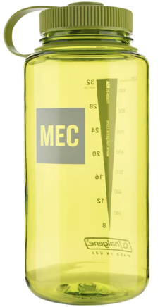
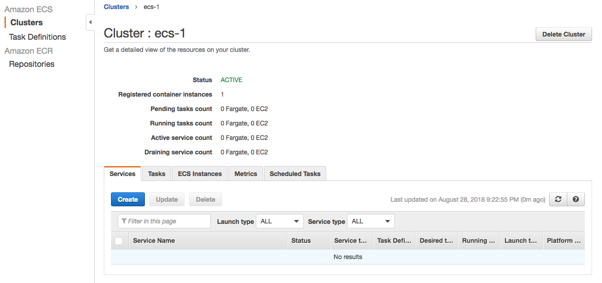
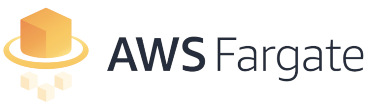
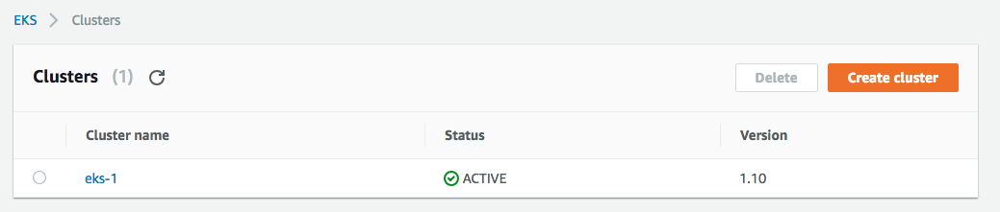

class: center, middle

# ECS to EKS
## Preparing for the journey

by Drew MacInnis

---
# What to pack?

* an AWS account
* an existing project running on ECS
* terraform using terraform modules 
  * backpack full of [terraform-aws-modules](https://github.com/terraform-aws-modules)
* plenty of food and water

</img>
 
---
# Where are we starting from?

* not an expert in ECS or EKS/k8s...
* working with a project with microservices running in ECS
* using a simplified environment for experimentation:
  * [github.com/drmdrew/ecs-eks-demo][1]

[1]: https://github.com/drmdrew/ecs-eks-demo
---
# ECS

* AWS Elastic Container Service
* First launched in [Nov 2014][2] ... so early on for modern containers...
* For reference:
  * FreeBSD Jails/Solaris Zones/etc.: *Late 1990s, early 2000s*
  * Google Borg (proprietary): *~2003-2004*
  * Linux LXC: *~2008*
  * Docker released: [~2013][3]
  * Kubernetes v1.0: [July 2015][4]
  * Docker Swarm 1.0 (stand-alone): *Oct 2015*
  * Apache Mesos v1.0: *July 2016*
  * Docker Engine 1.12.0 (swarm mode): *Aug 2016*

[2]: https://en.wikipedia.org/wiki/Timeline_of_Amazon_Web_Services
[3]: https://blog.aquasec.com/a-brief-history-of-containers-from-1970s-chroot-to-docker-2016
[4]: https://blog.risingstack.com/the-history-of-kubernetes/
---
# ECS (recently)

* [Docker Volumes and Volume Plugins][5]: Aug 2018
  * prior to this...
    * (ugly?) custom shell scripting, AMIs, etc.
* [Service Discovery][6]: March 2018
  * prior to this...
    * run your own consul/etcd/...
    * ... or, ELBs _everywhere_  ($$$)
  * now ECS can use R53 Auto Naming APIs

[5]: https://aws.amazon.com/about-aws/whats-new/2018/03/introducing-service-discovery-for-amazon-ecs/
[6]: https://aws.amazon.com/about-aws/whats-new/2018/08/amazon-ecs-now-supports-docker-volume-and-volume-plugins/

---
# ECS - quick demo

</img>

**Trigger Warning**: Mild use of `curl`.

---
# Detour: Fargate?

* introduced [Nov 2017][7]
* "deploying and managing containers without having to manage any of the underlying infrastructure"
* "billing is at a per second granularity"
* CaaS - Containers-as-a-Service

[7]: https://aws.amazon.com/about-aws/whats-new/2017/11/introducing-aws-fargate-a-technology-to-run-containers-without-managing-infrastructure/
---
# Fargate ECS - quick demo

</img>

**Trigger Warning**: Some `terraform`. Mild use of `curl`.
---
# Destination: k8s, EKS?

* climbing Mt. Kubernetes
* AWS EKS 
  * In preview Dec 2017
  * GA [June 2018][8]
* Let's take AWS EKS for a test-drive

[8]: https://aws.amazon.com/blogs/aws/amazon-eks-now-generally-available/
---
# EKS - quick demo

</img>

**Trigger Warning**: Some `terraform`. Mild use of `curl`. Coarse language.
---
# When you are engulfed in flames...

</img>

---
# EKS/Kubernetes Challenges

* Verify EKS k8s network setup
  * [Amazon VPC CNI Plugin][9]
```
kubectl describe daemonset aws-node --namespace kube-system | grep Image | cut -d "/" -f 2
```
* EKS ingress
  * [EKS Ingress Guide - @dmaas medium post][10]
  * terraform kubernetes_service type=LoadBalancer
  * `could not find any suitable subnets for creating the ELB` 
    * [AWS subnet tags][11]
  * ... approach leads to ELB-per-service
* Other ingress controllers
* Other CNI options: Calico, Flannel, Weave, oh my!
  * AWS VPC integration, pros/cons
* terraform kubernetes provider is lagging behind
  * [deployment resource support][12] (not yet)
  * pod + service resources work...
    * changes to pod resource destroy+recreate pod!
  * terraform + helm and/or other unholy tooling?

[9]: https://aws.amazon.com/blogs/opensource/vpc-cni-plugin-v1-1-available/
[10]: https://medium.com/@dmaas/amazon-eks-ingress-guide-8ec2ec940a70
[11]: https://github.com/kubernetes/kubernetes/issues/29298
[12]: https://github.com/terraform-providers/terraform-provider-kubernetes/issues/3

---
# Questions?

_I know I still have a lot of questions_

---

# Thank You
