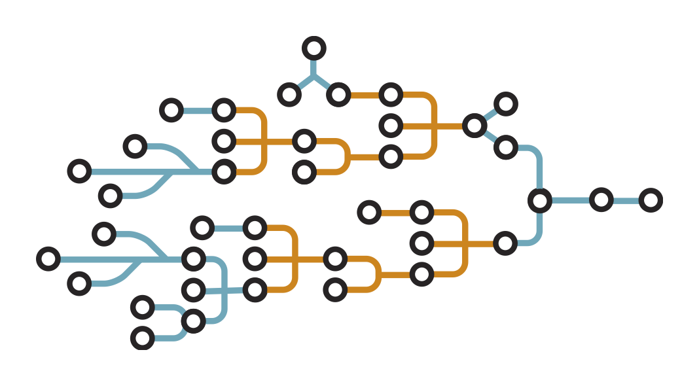

layout: true

background-image: url(https://raw.githubusercontent.com/DockerOttawaMeetup/Slides/master/ottawa-docker-logo.jpg)
background-size: 64px
background-position: right 12px bottom 40px

---
class: center, middle

# 🚧👷‍♀️ BuildKit 👷‍♂️🏗

_Dave Henderson, February 2019_

---

## First, some history...

### Ancient history 📜

_Before `Dockerfile`s and `docker build`,_ images were layered on each other by running commands in a container, then `docker commit`ting the changes to save them to a new image...

- April 2013: A separate `docker-build` Python script first appeared around Docker v0.1.5, and could build something called a "changefile"
- ~May 2013: around v0.2.0 the changefile was starting to get called a `Dockerfile`
- May 2013, a new "docker builder" was starting to be integrated into the v0.3.1 release
- May/June 2013, the `docker build` command was "official" now in the v0.4.0 release

---

## First, some history...

### `Dockerfile` instructions 📃

- _v0.1.5_ (2013-04-17): `FROM`, `RUN`, `COPY`
- _v0.2.1_ (2013-05-01): `CMD`, `EXPOSE`, `MAINTAINER`
- _v0.3.4_ (2013-05-30): `ADD`, `COPY` deprecated
- _v0.4.8_ (2013-07-01): `ENTRYPOINT`
- _v0.5.0_ (2013-07-17): `VOLUME`
- _v0.6.0_ (2013-08-22): `USER`, `WORKDIR`
- _v0.8.0_ (2014-02-04): `ONBUILD`
- _v0.12.0_ (2014-06-05): `COPY` re-introduced
- v1.6.0 (2015-04-07): `LABEL`
- v1.9.0 (2015-11-03): `ARG`, `STOPSIGNAL`
- v1.12.0 (2016-07-28): `HEALTHCHECK`, `SHELL`, `#escape=` directive

_Since then, not much about the `docker build` command and the `Dockerfile` format has changed..._

---

## First, some history...

### The dawn of a new (build) era... 🌅

- In May 2017 (v17.05.0), multi-stage builds were introduced
  - very well-received, and prompted requests for other similar features
  - _but_ the original `builder` codebase was inflexible...
- Initial work on a new project named BuildKit was started around a month later

---

## What's BuildKit?


- a back-end technology for building container images
- doesn't depend on any of the original Docker/Moby codebase
- built to support containerd from the beginning
- written in Go

#### main benefits

- added performance
- better storage/caching management
- extensibility
- concurrent builds
  - runs steps in parallel when possible
  - optimizes out commands that are unnecessary

---

## What's BuildKit?

### LLB



- Back-end of BuildKit is based on a new **l**ow-**l**evel **b**uild definition format
- a new content-addressable dependency graph
- allows support of very complex build definitions
- everything about execution and caching of builds is handled by LLB
  - caching can even be done remotely
- LLB can be generated with a Go client package
- _**TL;DR:**_ LLB makes builds faster and better!

_But,_ BuildKit doesn't parse `Dockerfile`s...

---

## What's BuildKit?

### Frontends 🚪

- produce LLB from some other format, usually a human-readable file format
  - e.g. `Dockerfile`s, but not _exclusively_ `Dockerfile`s
- distributed as container images
- a `dockerfile` frontend is now shipped with BuildKit, and integrated into Docker 18.06 and later
- different frontends can be specified in `Dockerfile` with a header:
```dockerfile
#syntax=hairyhenderson/my-frontend:latest
FROM ...
```

---

## Using BuildKit with Docker

### Enabling ✅

- not _yet_ default builder for Docker
- either set `DOCKER_BUILDKIT=1` in your environment (as of v18.06), OR
- turn it on in your `daemon.json` (as of v18.09):

```json
{
  ...
  "features": {
    "buildkit": true
  },
  ...
}
```

---

## Using BuildKit with Docker

- just run `docker build` as usual
  - parallelized builds
  - smarter caching
  - fancy new output!
- use `--progress plain` for less fancy output
- use `docker builder prune` to prune BuildKit cache
- secrets can be provided with `docker build --secret`
  - mounted in-memory only
  - not saved in build cache
  - only available to build instructions that request them
- SSH agent socket can be exposed to the build with `docker build --ssh`
  - specific key can be given from agent, or allow all
- shared application caches with `RUN --mount=type=cache`

---

## Demos 🎭

- BuildKit
  - performance!
  - secrets!
  - ssh forwarding!
  - caching!

---

## Digging Deeper 🕳

- [docs for `dockerfile` frontend](https://github.com/moby/buildkit/blob/master/frontend/dockerfile/docs/experimental.md)
- [Tõnis Tiigi's blog post about `--secret` and `--ssh`](https://medium.com/@tonistiigi/build-secrets-and-ssh-forwarding-in-docker-18-09-ae8161d066)

---

## Thank you! 🙇‍

### Any Questions?
