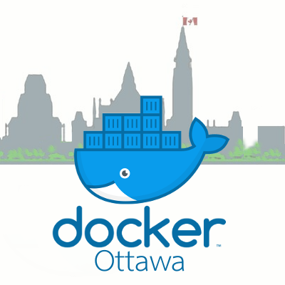

layout: true

background-image: url(./images/small-ottawa-v4.png)
background-size: 64px
background-position: right 12px bottom 40px

---
class: middle, center

# Docker Ottawa Meetup

---

## Community Code of Conduct!

We are dedicated to providing a harassment free experience for everyone

<table>
<tbody>
<tr><th style="text-align: left">Expected Behaviour</th><th style="text-align: left">Unacceptable Behaviour</th></tr>
<tr>
<td style="text-align: left; vertical-align: top">
<ul>
<li>Be professional.</li>
<li>Be responsible.</li>
<li>Be welcoming.</li>
<li>Be kind.</li>
<li>Be respectful of other viewpoints and ideas.</li>
<li>Be supportive and look out for each other.</li>
</ul>
</td>
<td style="text-align: left; vertical-align: top; width: 65%">
<ul>
<li>Offensive, inappropriate, or unwanted comments related to gender, gender identity or expression, sexual orientation, disability, physical appearance, body size, race, ethnicity, national origin, religion, or age, or other protected categories under applicable law.</li>
<li>Visual harassment eg. sexual imagery or use of sexual language at Docker community events</li>
<li>Disrespect towards differences of opinion</li>
<li>Deliberate intimidation, stalking, harassing photography or recording</li>
<li>Sustained disruption of talks or other events</li>
<li>Inappropriate or unwanted physical contact</li>
<li>Intimidation or bullying (online or in-person)</li>
<li>Unwelcome sexual attention</li>
</ul>
</td>
</tr>
</tbody>
</table>

---

## Thank you to our sponsors!

.center[]

_Let us know if your company is interested in sponsoring a future meetup!_

---

## Housekeeping

- Free Docker Training! https://training.play-with-docker.com
- Topic idea for future meetups? https://bit.ly/DockerOttawaIdeas
- Slides available at https://bit.ly/DockerOttawaSlides
- Connect with local Ottawa tech community in YOWDev Slack: https://bit.ly/yowdev
  - join the `#docker` channel!
- Join the Docker Community Slack instance: https://dockr.ly/community
- Washrooms out the back door _(block it with a chair!)_
- Entrance doors close at 7pm _(tell a buddy if you need to step out)_
